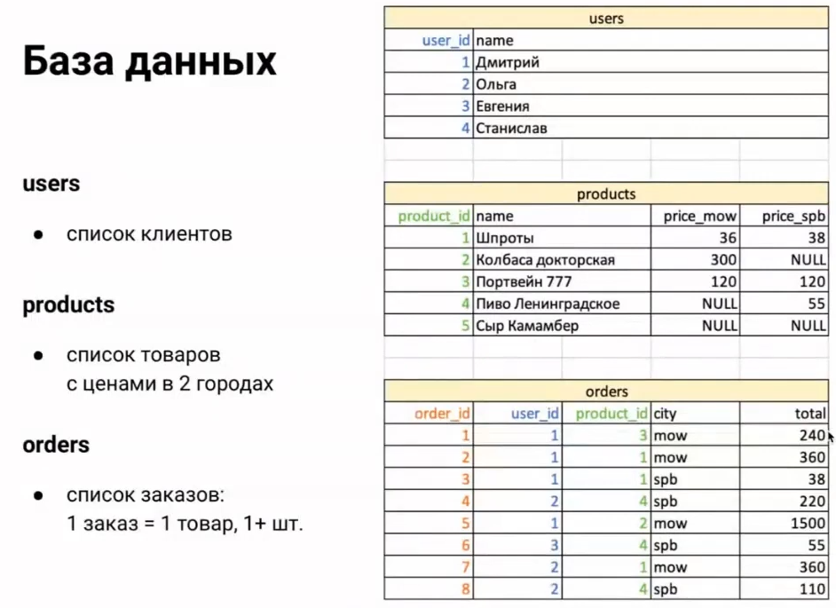

# SQL Problems

# Scripts

```sql
CREATE TABLE users (
user_id INT PRIMARY KEY,
name varchar(128));

INSERT INTO users (user_id, name) VALUES 
(1, 'Dima'), (2, 'Olga'), (3, 'Euginia'), (4, 'Stanislav');

CREATE TABLE products (
product_id INT PRIMARY KEY, 
name VARCHAR(128), 
price_mow INT, 
price_spb INT);

INSERT INTO products (product_id, name, price_mow, price_spb) VALUES 
(1, 'Fish', 36, 38), (2, 'Wurst', 300, null), 
(3, 'Portwine 777', 120, 120),
(4, 'Beer', null, 55), (5, 'Cheese', null, null);

CREATE TABLE orders (
order_id INT PRIMARY KEY,
user_id INT NOT NULL,
product_id INT NOT NULL,
city VARCHAR(128) NOT NULL,
total INT NOT NULL,
CONSTRAINT fk_users_user_id 
	FOREIGN KEY (user_id) REFERENCES users(user_id),
CONSTRAINT fk_products_product_id 
	FOREIGN KEY (product_id) REFERENCES products(product_id));

INSERT INTO orders (order_id, user_id, product_id, city, total) VALUES
(1, 1, 3, 'mow', 240),
(2, 1, 1, 'mow', 360),
(3, 1, 1, 'spb', 38),
(4, 2, 4, 'spb', 220),
(5, 1, 2, 'mow', 1500),
(6, 3, 4, 'spb', 55),
(7, 2, 1, 'mow', 360),
(8, 2, 4, 'spb', 110);
```

# Tables



# Problems

## p1 - Select client name for every order

```sql
-- MySQL
-- Inner Join
SELECT o.order_id, u.name 
FROM orders o INNER JOIN users u 
ON o.user_id=u.user_id;
-- Join Using
SELECT o.order_id, u.name 
FROM orders o JOIN users u 
USING (user_id);
-- Natural Join
SELECT o.order_id, u.name 
FROM orders o NATURAL JOIN users u;
```

## p2 - Select clients with total sum greater than 500

```sql
SELECT u.name, sum(total) AS total_sum 
FROM orders o JOIN users u 
ON o.user_id=u.user_id 
GROUP BY o.user_id HAVING total_sum > 500;
```

## p3 - Select products which are presented only in one city

```sql
SELECT name, 'mow' as city, price_mow as price FROM products
WHERE (price_spb IS NULL AND price_mow IS NOT NULL) 
UNION
SELECT name, 'spb', price_spb FROM products
WHERE (price_spb IS NOT NULL AND price_mow IS NULL);
```

## CASE / IF() / IFNULL() / COALESCE()

| IF(e, A, B) | return (e <> 0 && e IS NOT NULL) ? A : B | select order_id, total, IF(total > 300, 'expensive', 'cheap') FROM orders; |
| --- | --- | --- |
| IFNULL(e, B) | return (e IS NOT NULL) ? e : B |  |
| COALESCE(e1, e2…) | return firstNonNullValue(e1, e2, …) |  |

## p4 - Select clients with total sum less than 500 including clients that have no orders

```sql
SELECT u.name, coalesce(sum(total), 0) AS sum_total 
FROM orders o RIGHT JOIN users u ON u.user_id=o.user_id 
GROUP BY u.name HAVING sum_total < 500;
```

## p5 - Count percent of orders more expensive than 300

```sql
-- Example works in MySQL
SELECT avg(IF(total > 300, 1, 0)) * 100 FROM orders;
-- or even shorter (if specific RDBMS allows it)
SELECT avg(total > 300) * 100 FROM orders;

-- Example works in Postgres
SELECT avg(
CASE 
	WHEN (total > 200) THEN 1 
	ELSE 0 
END) * 100
FROM orders;
```

## p6 - Pivot table orders so that prices for different cities are in different rows

```sql
SELECT product_id, name, 'mow' AS city, price_mow AS price FROM products
UNION
SELECT product_id, name, 'spb', price_spb FROM products
ORDER BY product_id, city;
```
